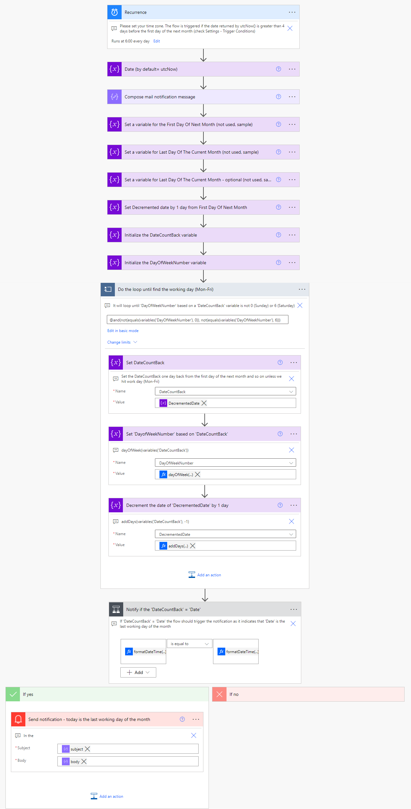

# Be notified about the last working day of the month (except holidays)

## Summary

Send an e-mail notification on the last **working** day of the month.
The original post can be found at PowerUser community: [Send an e-mail notification the last working day of the month](https://powerusers.microsoft.com/t5/Power-Automate-Cookbook/Send-an-e-mail-notification-the-last-working-day-of-the-month/td-p/787942)

## Applies to

* [Microsoft Power Automate](https://docs.microsoft.com/power-automate/)

## Compatibility

## Authors

| Solution               | Author(s)                                                                                               |
| ------------------------ | --------------------------------------------------------------------------------------------------------- |
| NotifyOnLastWorkingDay | [Michal Ziemba](https://github.com/Michal-Ziemba) ([@Michal_Ziemba](https://twitter.com/Michal_Ziemba)) |

## Version history

| Version | Date            | Comments                   |
| --------- | ----------------- | ---------------------------- |
| 1.1     | March 07, 2022  | Update variables, comments |
| 1.0     | January 4, 2021 | Initial release            |

## Features

This sample demonstrates:

* how to get the first day of the month
* how to get the last day of the month regardless of the leap year
* how to check if a particular date (by default it is the current date) is the last working day of the month regardless of the leap year
* how to minimize the flow schedule trigger to the last 4 days of each month

Assumptions:

* Monday is the first day of the week
* Working days are from Monday to Friday
* Saturday and Sunday are non-working days

The last day of the month is counted by subtracting one day from the first day of the next month.

The scheduled flow uses trigger conditions that minimize flow runs to the last 4 days in the month (the flow is triggered if the date returned by utcNow() is greater than 4 days before the first day of the next month).
By changing the 'date' variable in the flow you can check if the next day or day before next is the last working day of the month and be notified in advance.

Because self-reference is not supported (yet) when updating the value of the variable in **Do Until** loop I had to use an extra stage variable.

## Prerequisites

> Any special pre-requisites? Include anything that needs to be done for this sample to work (anything in addition to importing the `.zip` and data sources).
> DELETE THIS PARAGRAPH BEFORE SUBMITTING

## Minimal Path to Awesome

* [Download](./solution/YOURSAMPLENAME.zip) the `.zip` from the `solution` folder
* Browse to [Power Automate](https://flow.microsoft.com/manage/environments) and select the environment where you wish to import the sample
* From the toolbar, select **Import**
* In the **Import package** page, select **Upload** and choose the `.zip` file containing the sample flow.
* Select **Import**
* ...

## Using the Source

You can also use the source and create your own `.zip` file by following these steps:

* ...

## Disclaimer

**THIS CODE IS PROVIDED *AS IS* WITHOUT WARRANTY OF ANY KIND, EITHER EXPRESS OR IMPLIED, INCLUDING ANY IMPLIED WARRANTIES OF FITNESS FOR A PARTICULAR PURPOSE, MERCHANTABILITY, OR NON-INFRINGEMENT.**

## Help

> Note: don't worry about this section, we'll update the links.

We do not support samples, but we this community is always willing to help, and we want to improve these samples. We use GitHub to track issues, which makes it easy for  community members to volunteer their time and help resolve issues.

If you encounter any issues while using this sample, [create a new issue](https://github.com/pnp/powerautomate-samples/issues/new?assignees=&labels=Needs%3A+Triage+%3Amag%3A%2Ctype%3Abug-suspected&template=bug-report.yml&sample=YOURSAMPLENAME&authors=@YOURGITHUBUSERNAME&title=YOURSAMPLENAME%20-%20).

For questions regarding this sample, [create a new question](https://github.com/pnp/powerautomate-samples/issues/new?assignees=&labels=Needs%3A+Triage+%3Amag%3A%2Ctype%3Abug-suspected&template=question.yml&sample=YOURSAMPLENAME&authors=@YOURGITHUBUSERNAME&title=YOURSAMPLENAME%20-%20).

Finally, if you have an idea for improvement, [make a suggestion](https://github.com/pnp/powerautomate-samples/issues/new?assignees=&labels=Needs%3A+Triage+%3Amag%3A%2Ctype%3Abug-suspected&template=suggestion.yml&sample=YOURSAMPLENAME&authors=@YOURGITHUBUSERNAME&title=YOURSAMPLENAME%20-%20).

## For more information

- [Create your first flow](https://docs.microsoft.com/en-us/power-automate/getting-started#create-your-first-flow)
- [Microsoft Power Automate documentation](https://docs.microsoft.com/en-us/power-automate/)

